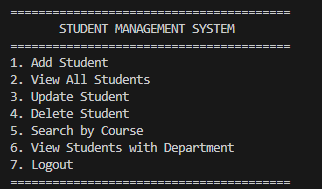
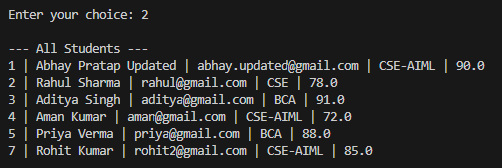
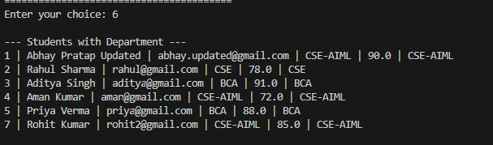

# Student Management System

A console-based Student Management System developed using Java, Object-Oriented Programming (OOP), JDBC, and MySQL. The project provides student CRUD operations, authentication, role-based access, course search, input validation, and department integration.

## Project Overview

The Student Management System is designed to manage student records efficiently through a Java-based console application connected to a MySQL database using JDBC.

The project demonstrates practical implementation of:

- Object-Oriented Programming
- Java Exception Handling
- JDBC Database Connectivity
- SQL CRUD Operations
- Primary Key and Foreign Key relationships
- SQL JOIN operations
- Input Validation
- User Authentication
- Role-Based Access Control

## Features

- User Login Authentication
- Admin and User roles
- Add Student
- View All Students
- Update Student
- Delete Student
- Search Students by Course
- View Students with Department
- Input Validation
- Marks validation from 0 to 100
- Email uniqueness through database constraint
- Department integration using Foreign Key
- JDBC connectivity with MySQL
- PreparedStatement for SQL queries
- Console-based user interface

## Technologies Used

| Technology | Purpose |
|---|---|
| Java | Application development |
| OOP | Object-oriented design |
| JDBC | Java-MySQL connectivity |
| MySQL | Database management |
| SQL | Database operations |
| VS Code | Development environment |
| Git | Version control |
| GitHub | Project hosting |

## Project Structure

```text
StudentManagementSystem
├── .vscode
│   └── settings.json
├── lib
│   └── mysql-connector-j-26.7.0.jar
├── screenshots
│   ├── login.png
│   ├── admin-menu.png
│   ├── students-list.png
│   └── students-department.png
├── src
│   ├── dao
│   │   ├── LoginDAO.java
│   │   └── StudentDAO.java
│   ├── model
│   │   ├── Department.java
│   │   └── Student.java
│   ├── util
│   │   └── DatabaseConnection.java
│   ├── Main.java
│   └── TestConnection.java
├── README.md
└── .gitignore
```

## Database Design

The project uses a MySQL database named `student_management`.

### Students Table

| Column | Type | Description |
|---|---|---|
| id | INT | Primary Key |
| name | VARCHAR(100) | Student name |
| email | VARCHAR(100) | Unique email |
| course | VARCHAR(50) | Student course |
| marks | DOUBLE | Student marks |
| dept_id | INT | Foreign Key |

### Departments Table

| Column | Type | Description |
|---|---|---|
| dept_id | INT | Primary Key |
| dept_name | VARCHAR(100) | Department name |

### Users Table

| Column | Type | Description |
|---|---|---|
| id | INT | Primary Key |
| username | VARCHAR(50) | Login username |
| password | VARCHAR(100) | Login password |
| role | VARCHAR(20) | ADMIN / USER |

## Database Relationship

The `students` table is connected with the `departments` table using a foreign key.

```text
Students
   |
   | dept_id
   v
Departments
```

This relationship allows the application to display student information along with department information using SQL JOIN.

## CRUD Operations

| Operation | Function |
|---|---|
| Create | Add Student |
| Read | View All Students |
| Update | Update Student |
| Delete | Delete Student |
| Search | Search by Course |

## Role-Based Access

### Admin

Admin users can:

- Add students
- View students
- Update students
- Delete students
- Search students
- View department information

### User

Normal users can:

- View students
- Search students by course
- View department information

Users cannot add, update, or delete student records.

## Login & Role-Based Access

The application provides authentication with two roles:

- **ADMIN** – Can add, view, update, delete and search student records.
- **USER** – Can view and search student records.

> Demo credentials are intentionally not published in this repository.

> Note: Plain-text passwords are used only for this academic/demo project. Production applications should store passwords using secure password hashing.

## Validation

The application performs input validation before inserting or updating records.

- Name cannot be empty
- Email cannot be empty
- Course cannot be empty
- Marks must be between 0 and 100
- Course must be a valid supported course
- Student ID must be valid
- Email uniqueness is enforced by the database

Supported courses:

- CSE-AIML
- CSE
- BCA

## OOP Concepts Used

### Encapsulation

Student and Department data is stored in private fields and accessed through getters and setters.

### Classes and Objects

The project uses classes such as:

- Student
- Department
- StudentDAO
- LoginDAO
- DatabaseConnection

### Constructors

Parameterized constructors are used to initialize Student and Department objects.

### Abstraction

Database operations are separated into DAO classes so that the main application does not directly handle SQL queries.

## JDBC Concepts Used

The project uses JDBC for connecting Java with MySQL.

Main JDBC components used:

- Connection
- PreparedStatement
- ResultSet
- DriverManager

The application uses `PreparedStatement` for parameterized SQL queries.

## SQL Concepts Used

The project demonstrates:

- CREATE DATABASE
- CREATE TABLE
- INSERT
- SELECT
- UPDATE
- DELETE
- WHERE
- JOIN
- PRIMARY KEY
- FOREIGN KEY
- UNIQUE
- NOT NULL
- AUTO_INCREMENT

## Screenshots


### Admin Menu



### Student List



### Students with Department



## How to Run

### 1. Clone the Repository

```bash
git clone https://github.com/pratapabhay01/StudentManagementSystem.git
```

### 2. Open the Project

Open the project in VS Code or another Java IDE.

### 3. Configure MySQL

Create the database:

```sql
CREATE DATABASE student_management;
```

Create the required tables and insert the required records.

### 4. Configure Database Connection

Open:

`src/util/DatabaseConnection.java`

Update the MySQL password according to your local MySQL installation.

### 5. Compile

From the `src` folder:

```powershell
javac -cp "..\lib\mysql-connector-j-26.7.0.jar;." Main.java
```

### 6. Run

```powershell
java -cp "..\lib\mysql-connector-j-26.7.0.jar;." Main
```

## Exception Handling

The application uses Java exception handling to manage database and runtime errors.

Example:

```java
try {
    // Database operation
} catch (Exception e) {
    e.printStackTrace();
}
```

This helps prevent unexpected application termination during database operations.

## Project Learning Outcomes

Through this project, I gained practical experience in:

- Java programming
- Object-Oriented Programming
- JDBC
- MySQL database management
- SQL queries
- CRUD operations
- Database relationships
- Authentication
- Role-based access control
- Input validation
- Git and GitHub
- Project documentation

## Future Improvements

Possible future improvements include:

- Password hashing
- GUI using JavaFX or Swing
- Web-based interface
- Spring Boot integration
- REST API
- Advanced search and filtering
- Pagination
- Student performance reports
- Admin dashboard
- Cloud database integration

## Author

**Abhay Pratap**

CSE-AIML Student

This project was developed as a practical Java and database project to strengthen programming, OOP, JDBC, SQL, and software development skills.

## GitHub Repository

[Student Management System](https://github.com/pratapabhay01/StudentManagementSystem)

Built with Java, OOP, JDBC, and MySQL.
